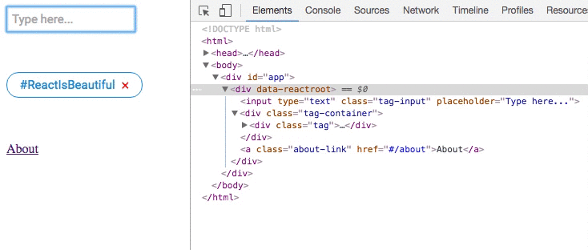
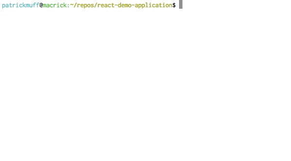

# react-demo-application

I wanted to try out React.js and tried to setup a somewhat realistic project. It features the following things:

- Webpack
- TypeScript
- ESLint
- Karma Unit Test Runner with Mocha

## Demonstration

### Browser



### Unit Tests



## Available Commands

Start a watch process for development:

```
npm run dev
```

Build and minify everything for production:

```
npm run build
```

Run unit tests:

```
npm test
```

Run ESLint:

```
npm run lint
```

Open `src/client/index.html` in your browser to see the React application!
